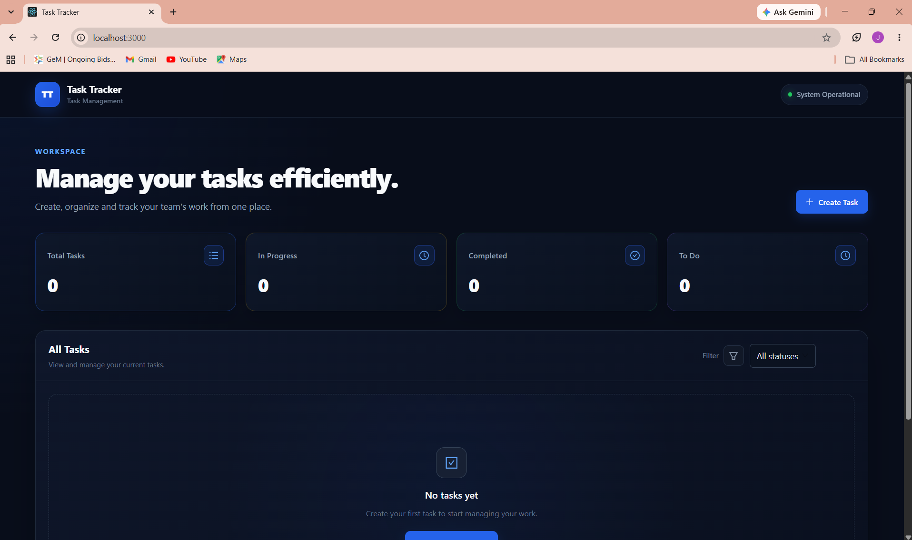
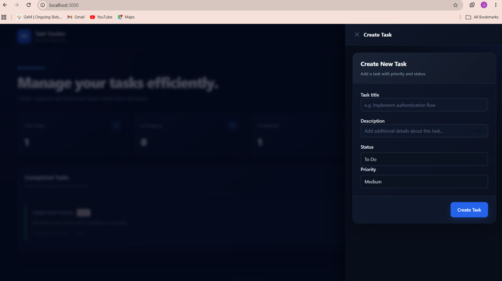
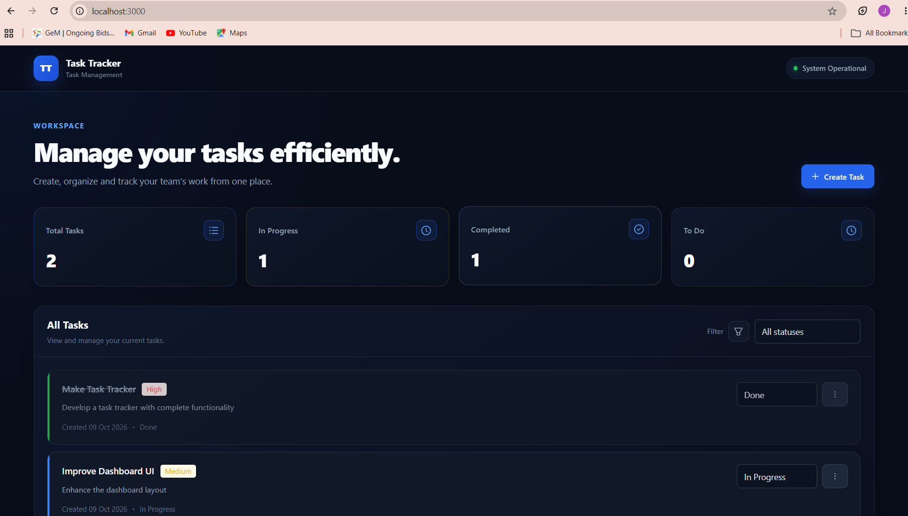
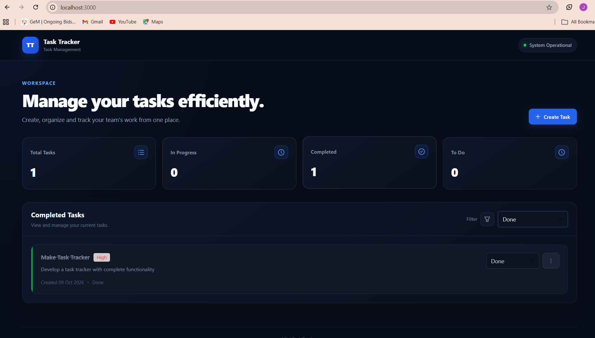

# Task Tracker Mongo

A full-stack task management application built with React, TypeScript, Node.js,
Express.js and MongoDB. The application allows users to create, view, update,
filter and delete tasks with different statuses and priorities.

## Features

- Create tasks with title, description, status and priority
- Task statuses:

* To Do
* In Progress
* Done

- Task priorities:

* Low
* Medium
* High

- View all tasks
- Filter tasks by status
- Update task status
- Delete tasks with confirmation
- MongoDB persistence
- Server-side validation
- Useful API error messages
- Loading states
- TypeScript across frontend and backend

## Tech Stack

### Frontend

- React
- TypeScript
- Ant Design
- Tailwind CSS
- CSS

### Backend

- Node.js
- Express.js
- TypeScript
- MongoDB
- Mongoose

## Project Structure

```text
task-tracker-mongo/
│
├── client/
│   ├── public/
│   ├── src/
│   │   ├── components/
│   │   ├── services/
│   │   ├── types/
│   │   ├── hooks/
│   │   ├── App.tsx
│   │   ├── App.css
│   │   ├── index.css
│   │   └── index.tsx
│   ├── .env.example
│   ├── package.json
│   ├── tsconfig.json
│   └── webpack.config.js
│
├── server/
│   ├── src/
│   │   ├── config/
│   │   ├── controllers/
│   │   ├── middleware/
│   │   ├── models/
│   │   ├── routes/
│   │   ├── services/
│   │   ├── errors/
│   │   ├── validators/
│   │   ├── app.ts
│   │   └── server.ts
│   ├── tests/
│   ├── .env.example
│   ├── package.json
│   └── tsconfig.json
│
└── README.md
```

## Installation

### Prerequisites

Make sure the following are installed before running the project:

- Node.js 18+
- npm
- MongoDB
- Git

### Clone the Repository

```bash
git clone https://github.com/jahnvi-vyas/task-tracker-mongo.git
cd task-tracker-mongo
```

## Backend Setup

Navigate to the backend directory:

```bash
cd server
```

Install the backend dependencies:

```bash
npm install
```

Create a `.env` file inside the `server` directory.

```env
NODE_ENV=development
PORT=5000
MONGODB_URI=mongodb+srv://<username>:<password>@<cluster>/<database>
MONGODB_TEST_URI=mongodb+srv://<username>:<password>@<cluster>/<test-database>
CLIENT_URL=http://localhost:3000
```

> Replace the MongoDB connection values with your own local or MongoDB Atlas
> configuration.

Start the backend development server:

```bash
npm run dev
```

The backend will run on:

```text
http://localhost:5000
```

## Frontend Setup

Open a new terminal and navigate to the client directory:

```bash
cd client
```

Install the frontend dependencies:

```bash
npm install
```

Create a `.env` file inside the `client` directory:

```env
NODE_ENV=development
BASE_URL=http://localhost:5000
```

Start the frontend development server:

```bash
npm run dev
```

The frontend will be available at:

```text
http://localhost:3000
```

## Environment Variables

Environment variables are used to configure the frontend and backend
applications.

### Client `.env`

```env
NODE_ENV=development
BASE_URL=http://localhost:5000
```

### Client `.env.example`

The repository contains a `.env.example` file without credentials:

```env
NODE_ENV=development
BASE_URL=http://localhost:5000
```

### Server `.env`

```env
NODE_ENV=development
PORT=5000
MONGODB_URI=mongodb+srv://<username>:<password>@<cluster>/<database>
MONGODB_TEST_URI=mongodb+srv://<username>:<password>@<cluster>/<test-database>
CLIENT_URL=http://localhost:3000
```

### Server `.env.example`

The repository contains a `.env.example` file without real credentials:

```env
NODE_ENV=development
PORT=5000
MONGODB_URI=
MONGODB_TEST_URI=
CLIENT_URL=http://localhost:3000
```

> Actual `.env` files must not be committed to the repository.

## API Endpoints

### Create Task

```http
POST /tasks
```

Creates a new task.

Example request:

```json
{
  "title": "Complete technical assignment",
  "description": "Finish the task tracker assignment",
  "status": "To Do",
  "priority": "High"
}
```

### Get Tasks

```http
GET /tasks
```

Returns all tasks.

Optional status filter:

```http
GET /tasks?status=Done
```

Supported statuses:

```text
To Do
In Progress
Done
```

### Update Task Status

```http
PATCH /tasks/:id
```

Updates the status of an existing task.

Example request:

```json
{
  "status": "Done"
}
```

### Delete Task

```http
DELETE /tasks/:id
```

Deletes a task after confirmation from the user interface.

## Screenshots

### Dashboard



### Create Task



### Task List



### Filer Task



## Assignment Submission

This project was developed as part of the **MERN Candidate Technical Assignment
– Mini Task Tracker**.

The implementation covers the requested task management functionality, MongoDB
persistence, server-side validation, API error handling, frontend usability and
automated tests.
